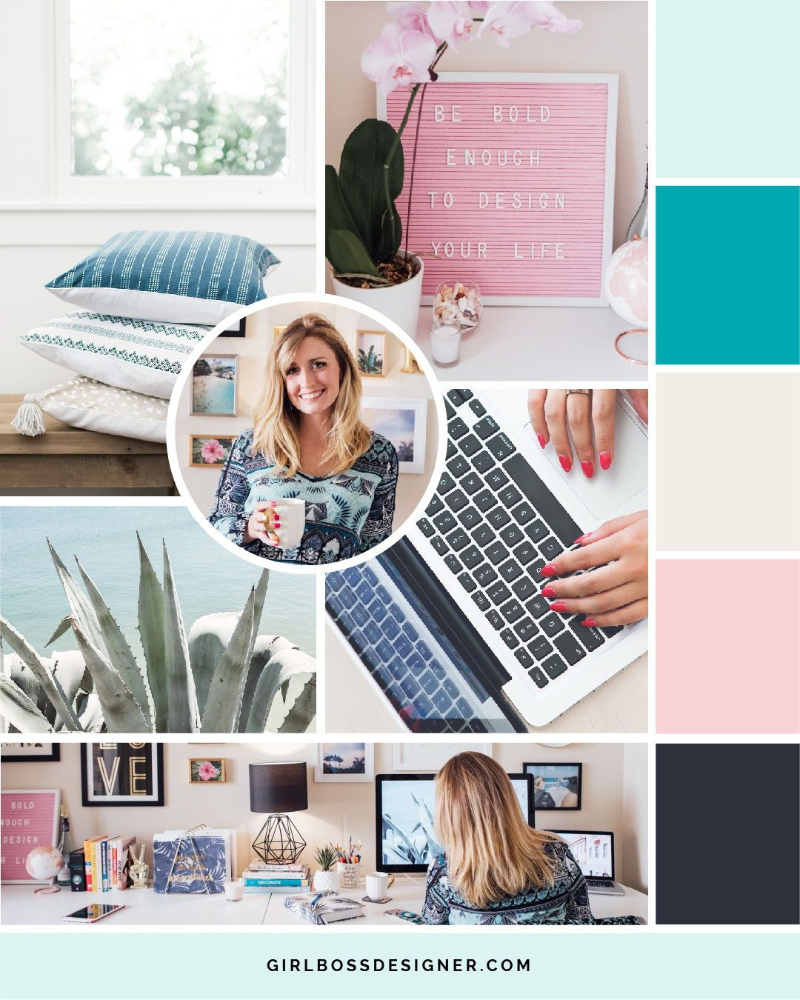
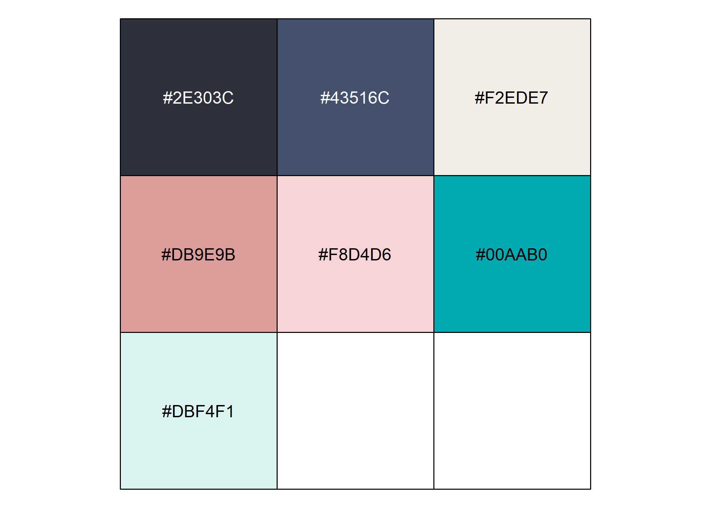
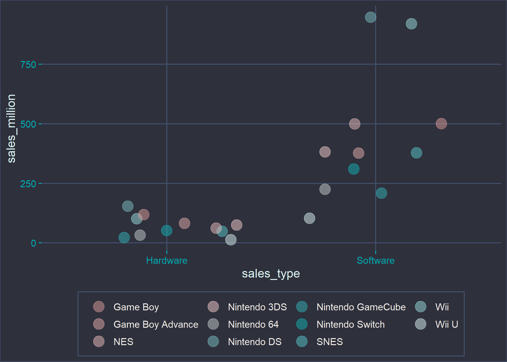

<!-- README.md is generated from README.Rmd. Please edit that file -->

# ggcute

<!-- badges: start -->

<!-- badges: end -->

A meme built upon the super cute ggcute package.

## Installation

You can install the original ggcute from GitHub with:

``` r
# install.packages("remotes")
remotes::install_github("sharlagelfand/ggcute")
```

## \#Girlboss Alert

I want to get better at R coding so this is just for funsies. I am a
ggcute stan so I started with modifying Sharla’s code for a different
colour palette. I wanted something to rhyme with fairyfloss so naturally
this gave creation to the girlboss theme 👩. A quick google search of the
term ‘girlboss colour scheme’ gave me a pinterest colour board that I
copied (I have no original thoughts).



``` r
show_col(ggcute:::girlboss_colours)
```



Ta da\! I had fun\!

``` r
ggplot(nintendo_sales, aes(x = sales_type, y = sales_million, colour = console)) +
  geom_jitter(size = 5, alpha = 0.5) +
  scale_colour_girlboss() +
  theme_girlboss(base_size = 12) +
  theme(
    legend.position = "bottom",
    legend.title = element_blank()
  )
```


